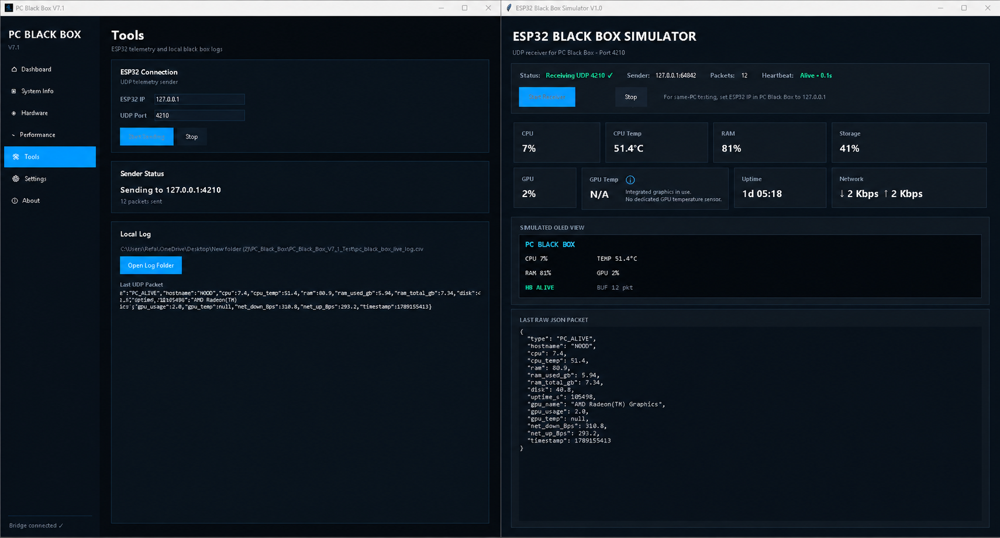

# PC Black Box

## Download
[⬇️ Download PC Black Box V7.1](https://github.com/i54N7/PC-Black-Box/releases/download/v7.1.0/PC_Black_Box_V7.1.zip)

**PC Black Box** is a Windows monitoring application designed to act like a black box for a computer.
## How to Run

1. Download `PC_Black_Box.zip` from the release page.
2. Extract the ZIP file.
3. Keep all files inside the extracted folder together.
4. Open `PC_Black_Box.exe`.
5. The application will start and the Hardware Bridge will run in the background.

> Important: Do not move `PC_Black_Box.exe` away from the `HardwareBridgeRuntime` folder, because the application needs it to read hardware sensor data.

The project monitors important system information in real time, including CPU usage, CPU temperature, RAM usage, storage usage, GPU usage, uptime, and network activity.

The long-term goal is to connect the Windows application to an ESP32 device that can independently receive, display, timestamp, and store recent telemetry so the last system state can be reviewed after a freeze, crash, or sudden power loss.

## Main Features

- Real-time CPU monitoring
- CPU temperature monitoring
- RAM usage monitoring
- Storage usage monitoring
- GPU usage monitoring
- System uptime
- Network upload/download monitoring
- Live performance graphs
- Dark, Midnight, and Light themes
- Local CSV logging
- ESP32 telemetry over UDP
- JSON-based data exchange
- Standalone Windows EXE build
- Custom PC Black Box interface and branding

## How the Project Works

### 1. Main Windows Application — Python

The graphical application is written in **Python**.

Python is responsible for:

- The graphical user interface
- Reading CPU, RAM, storage, uptime, and network information using `psutil`
- Reading hardware sensor data from the Hardware Bridge
- Displaying live system statistics
- Saving local logs
- Sending telemetry to the ESP32 using UDP
- Converting telemetry to JSON
- Managing themes and application settings

The application is packaged as a Windows executable using **PyInstaller**.

### 2. Hardware Bridge — C#

Some hardware sensors, especially CPU temperature and GPU information, are not reliably available through `psutil` on Windows.

For this reason, I created a separate **C# Hardware Bridge** using **.NET 8** and `LibreHardwareMonitorLib`.

The Hardware Bridge:

1. Reads hardware sensors from the computer.
2. Updates the sensor data approximately once per second.
3. Writes the data to `hardware_sensors.json`.
4. The Python application reads that JSON file and displays the values.

This separates hardware sensor access from the main user interface and makes the system easier to maintain and troubleshoot.

## ESP32 Integration

The planned hardware side uses an **ESP32**.

The PC and ESP32 connect to the same Wi-Fi network.

The Windows application sends JSON telemetry approximately once per second to the ESP32 using:

- Protocol: **UDP**
- Port: **4210**

Planned ESP32 hardware:

- ESP32
- OLED SSD1306
- MicroSD module
- DS3231 RTC
- Optional DS18B20 temperature sensor
- Optional PC817 optocoupler for PC power detection

The ESP32 will eventually:

- Receive telemetry from the PC
- Display important values on the OLED
- Add timestamps using the DS3231
- Save telemetry to MicroSD
- Monitor heartbeat loss
- Keep a rolling 30–60 second history
- Stay powered independently from the PC

## Technologies Used

| Technology | Purpose |
|---|---|
| Python (`.py`) | Main application and GUI |
| C# (`.cs`) | Hardware Bridge |
| .NET 8 | Runtime/platform for the C# bridge |
| psutil | CPU, RAM, storage, uptime, and network monitoring |
| LibreHardwareMonitorLib | Hardware sensor access |
| JSON | Data exchange between components |
| UDP | PC-to-ESP32 telemetry |
| Tkinter | Windows GUI |
| PyInstaller | Packaging Python application as EXE |
| NuGet | C#/.NET package management |
| BAT / CMD | Windows build and automation commands |

## Why Two Programming Languages?

I used **Python** because it is practical for building the graphical interface, system monitoring, logging, and networking.

I used **C#** because LibreHardwareMonitor integrates more reliably with .NET for reading Windows hardware sensors.

Instead of forcing one language to handle everything, I separated the project into components and used each language where it was most suitable.

## Sensor Notes

The application only displays sensor values that are actually available.

For example, on the development computer, CPU temperature and AMD Radeon GPU usage are available, but the integrated GPU does not expose a separate GPU temperature sensor.

When a sensor is unavailable, the application displays `N/A` instead of generating a fake value.

## Project Structure

Typical source files include:

```text
pc_black_box_v7_FINAL.py
HardwareBridge.cs
HardwareBridgeRuntime/
PC_Black_Box_NEW.ico
requirements.txt
build_pc_black_box_v7_FINAL.bat
```

Generated build folders, temporary files, logs, and local settings do not need to be committed to the source repository.

## Running the Final Application

The final application folder contains:

```text
PC_Black_Box.exe
HardwareBridgeRuntime/
PC_Black_Box_NEW.ico
requirements.txt
```

The complete folder should be kept together because the Hardware Bridge is required for hardware sensor monitoring.

Python does not need to be installed on the user's computer when running the packaged EXE.

## Future Development

- Complete ESP32 firmware
- OLED live system display
- MicroSD black-box logging
- DS3231 timestamping
- Heartbeat failure detection
- Independent PC power detection
- 30–60 second rolling buffer
- ESP32 Access Point mode
- Windows installer

## Project Author

**The project was designed and programmed by Moayad Alharbi**

Social Media: **IG @54N7**

## Version

Current application version: **PC Black Box V7.1**
